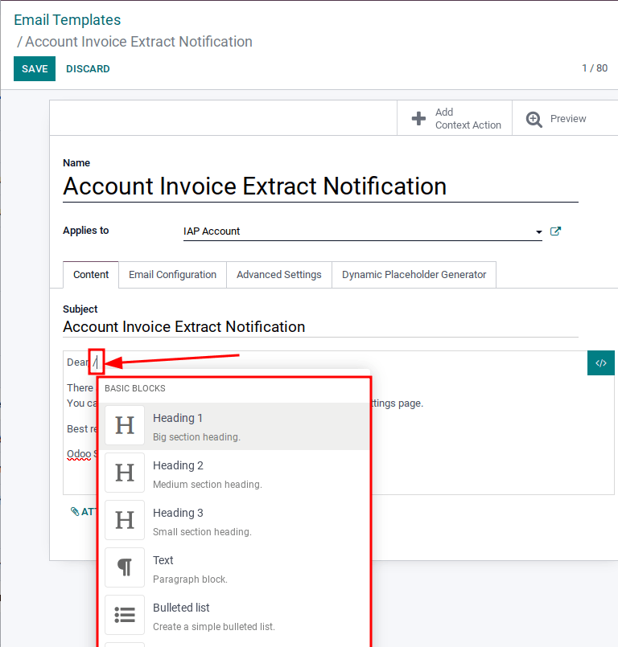
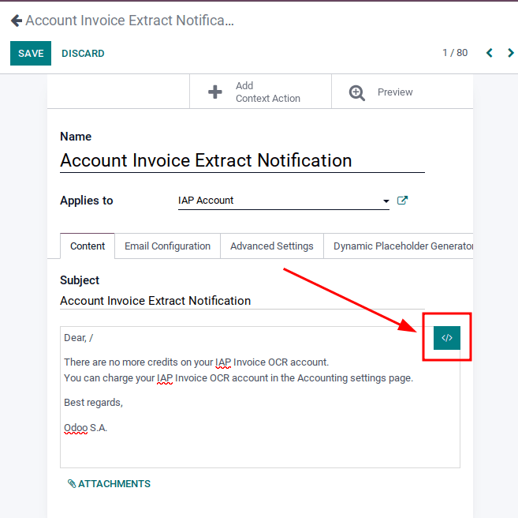
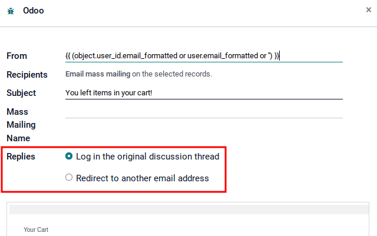
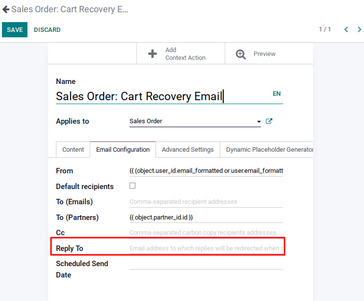

===============
Email templates
===============

Writing effective emails is vital for receiving a high response rate. Email templates allow users to
send emails without having to compose or rewrite the same structure repeatedly, saving time and
improving efficiency. Creating different templates tailored to specific situations lets users choose
the right message for the right audience, which helps to increase engagement.

.. note::
   Odoo's email templates use QWeb or XML. The composer allows the user to edit emails in their
   final rendering, making customizations more robust as the user doesn't have to edit code.

Editing email templates
=======================

Starting with Odoo 15, the Powerbox feature can be used. The Powerbox allows for the user to edit
the format of the text, to add links or buttons, appointment options, and to add images to the email
template. Additionally, the XML/HTML code of the email template can be edited via the
:guilabel:`</>` icon. Dynamic placeholders (referencing fields within Odoo) are only available in
the subject line and to and from fields in Odoo 15.

Powerbox feature
----------------

The Powerbox feature is an enriched text editor with various options for formatting layout and text,
and adding XML/HTML features in an email template. The Powerbox is activated by typing a forward
slash `/` in the body of the email template.

The following options will be available once a forward slash `/` is typed in:

**Basic Blocks**

- Three different heading types (H1-H3: Small-Large)
- Text paragraph block
- Bulleted list
- Numbered list
- Checklist
- Table
- The ability to switch the direction of the text
- Horizontal separator
- Quote
- Add code to the text
- Add a specific appointment
- Schedule an appointment

**Navigation**

- Link
- Button

**Media**

- Image

To activate one of these options, simply click on it in the Powerbox. If it is a text option, then\
highlight the text, type in the activator key `/`, and select the option.

Editing via XML/HTML code
-------------------------

To access the XML/HTML editor for the email template click on the :guilabel:`</>` icon in the upper
right hand corner of the template. The icon will appear in turquoise.

Dynamic placeholders
--------------------

Dynamic placeholders are encoded to display fields from within the database. Dynamic placeholders
can no longer be used in Odoo 15 except for in the subject line, and to and from fields. Although
the generator is present as the last tab on the template, it will create placeholders for use only
in the above-mentioned fields. Dynamic placeholders may be inserted in the HTML code, but this task
is out of the scope of Odoo Support.

.. seealso::
   :doc:`../../../../services/support/what_can_i_expect`

Defining a default reply on the mail template
=============================================

Although the *reply to* field is available within email templates, **this field is only used for
mass mailing** mode (when sending emails in bulk). Emails can be sent in bulk in almost every
application that has a list view. Select the records where the emails are to be sent and click on
the :guilabel:`Action` button. If it is possible to send an email, a mail composer with values that
can be defined will appear.

Values can also be defined by default on the template:

Because of this, setting a value in this field is useless as the value defined will be totally
ignored. The default *reply-to* value is the default catchall email address, to ensure a
communication between the customer and the Odoo database. For more information about the way
the catchall works, check :ref:`how to manage inbound messages
<email_communication/inbound_messages>`.

Transactional emails and corresponding URLs for each company
============================================================

In Odoo, multiple events can trigger the sending of automated emails. These emails are known as
transactional emails and sometimes contain links pointing to the Odoo database.

By default, links generated by the database use the dynamic web.base.url key defined in the system
parameters. For more information about this, see :ref:`parameter <domain-name/web-base-url>`.

If the website application isn't installed, the web.base.url key will always be the default
parameter used to generate all the links.

It's important to know that the web.base.url key can only have a single value, meaning that in a
multi-website/company database environment, even there is a specific domain name for each
website, the links generated to share a document or within a transactional email may remain the
same, whatever the website/company related to the sending of the email/document.

.. example::
   If the value of the web.base.url system parameter is equal to ``https://www.purpletest.com`` and
   there are two separate websites in Odoo with different URLS: ``https://www.purplecompany.com``
   and ``https://www.purpleteam.com``, the links created by Odoo to share a document or send a
   transactional email will come from the domain: ``https://www.purpletest.com``.

This is not always the case as some Odoo applications have a link established in the database with
the website application, meaning that in this case, if a specific domain is defined for the
websites, the URL generated in the email template will use the domain defined on the corresponding
website of the company.

.. caution::
   A document shared using the documents application will always use the web.base.url key, as the
   document shared isn't associated with any particular website. Meaning that the URL will always be
   the same (the web.base.url key value), whatever the company it's shared from, this is a known
   limitation!

On the other hand, sales orders made by a customer on an Odoo e-commerce website have a link
established with the website from which the order was made. As a result, the e-mail sent for sales
orders uses the domain name defined for the corresponding website to generate the links.

For more information about how to configure domains, check out :doc:`our domain name documentation
</administration/maintain/domain_names>`.

Updating translations within email templates
--------------------------------------------

Email templates are automatically translated. Changing the translations shouldn't be necessary.
However, if for a specific reason, some of the translations need to be changed, it can be done.

Like any modification in the code, keep in mind that if they aren't done correctly (for example,
modifications leading to bad syntax), it can break the template, and as a result, the template will
appear blank.

In order to edit translations, follow these steps from the template:

#. Click on the :guilabel:`edit` button, then on the language button

   .. image:: email_template/edit-language-template.png
      :align: center
      :alt: Edit the language of a template.

#. A pop-up window with the different languages installed on the database will be displayed. From
   here, editing the translations will be possible. Don't forget to hit the :guilabel:`Save` button
   to save the changes.

   .. image:: email_template/translation-body.png
      :align: center
      :alt: Translation of the body of the Appointment Booked template.
