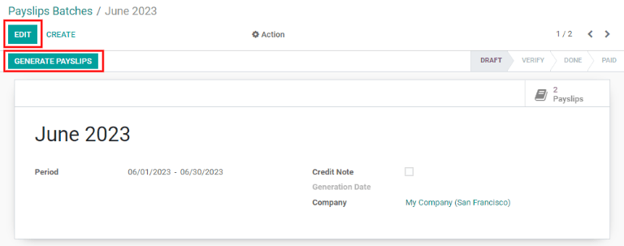

========
Payslips
========

In Odoo *Payroll*, the :guilabel:`Payslips` drop-down header menu consists of three
sections: :guilabel:`To Pay`, :guilabel:`All Pay Slips`, and :guilabel:`Batches`.

.. image:: payslips/payslips.png
   :align: center
   :alt: Payslips menu selection in Payroll.

These three sections provide all the tools needed to create payslips for employees, whether an
individual payslip, a batch of payslips, or commission payslips.

To pay
======

Click on :menuselection:`Payroll --> Payslips --> To Pay` to see the payslips that need to be paid.
On this page, Odoo displays the payslips that have not been generated yet, and can be created from
this dashboard.

.. image:: payslips/all-pay-slips.png
   :align: center
   :alt: View all payslips that need to be paid by clicking on Payslips - To Pay.

Each payslip will list the *Reference* number for the individual payslip, the *Employee* name,
*Batch Name*, the *From* and *To* date range, the *Company*, the *Basic Wage*, *Net Wage*, and the
*Status* of the payslip. Clicking on an individual payslip entry will show the details for the
individual payslip.

.. _payroll/new-payslip:

Create a new payslip
--------------------

A new payslip can be created by clicking the :guilabel:`Create` smart button in the top left.

.. image:: payslips/create-payslip.png
   :align: center
   :alt: Click the Create button to make a new payslip.

An empty payslip form will appear. Fill out the payslip information.

Required fields
~~~~~~~~~~~~~~~

.. image:: payslips/new-payslip.png
   :align: center
   :alt: The necessary fields for a new payslip.

- :guilabel:`Employee`: Select the employee from the drop down list. Several fields may be populated
  after making an Employee selection, typically the *Contract*, *Structure*, and *Payslip Name*
  fields.
- :guilabel:`Period`: Using the drop down, select the start and end date for the payslip. In the
  drop down, use the left and right arrows to select the month, and click on the day to select the
  date.
- :guilabel:`Contract`: Using the drop down menu, select the contract for the employee. Only the
  available correspoding contracts for the selected employee will appear as options.
- :guilabel:`Structure`: Using the drop down menu, select the salary structure type. Only the
  available correspoding structures for the selected contract for the specific employee will appear
  as options.
- :guilabel:`Payslip Name`: Type in the name for the payslip. The name should be short and
  descriptive, such as "April 2023".

.. image:: payslips/new-payslip-tab.png
   :align: center
   :alt: The necessary fields for a new payslip in the Acounting Information tab.

- :guilabel:`Company`: In the *Accounting Information* tab, select the company the payslip applies
  to from the drop down.
- :guilabel:`Salary Journal`: In the *Accounting Information* tab, enter the salary journal the
  payment will be reflected in in the *Accounting* applicaiton.

.. important::
   It is recommended to check with the accounting department to ensure any entry that affects the
   *Accounting* application is correct.

Optional fields
~~~~~~~~~~~~~~~

 - :guilabel:`Reference`: Any note or reference message for the new entry can be entered here.
 - :guilabel:`Company Car`: If applicable, select the company car from the drop down.
 - :guilabel:`Worked Days`: In the *Worked Days & Inputs* tab, the entry under :guilabel:`Worked
   Days` (the type, description, number of days, number of hours, and amount) will be automatically
   filled in based off what was entered for the period, contract, and structure.
 - :guilabel:`Salary Computation`: This section will be automatically filled in after the
   :guilabel:`Compute Sheet` smart button is clicked. This will display all the wages, deductions,
   taxes, etc for the entry.
 - :guilabel:`Batch Name`: Select the payslip batch this new payslip should be added to from the
   drop down.
 - :guilabel:`Made Payment Order`:
 - :guilabel:`Date Account`: Enter the date the payslip should be posted to by clicking on the drop
   down and navigating to the correct month and year by using the arrow icons, then clicking on the
   date.
 - :guilabel:`Salary Journal`: The journal that the payslip will be logged in is automatically
   selected when the *Contract* and *Structure* are entered (required fields).
 - :guilabel:`Accounting Entry`: Ths field is automatically filled in once the payslip is confirmed.

Save and process new payslip
~~~~~~~~~~~~~~~~~~~~~~~~~~~~

When all the information is entered, click :guilabel:`Save` to save the data, or click
:guilabel:`Discard` to delete the entry.

.. image:: payslips/save-payslip.png
   :align: center
   :alt: Save the payslip once the information is complete.

Once saved, click the :guilabel:`Compute Sheet` smart button to register all the information, and
have the *Salary Computation* tab populated. If any modifications need to be made, make the changes,
then click the :guilabel:`Recompute Worked Days` smart button to have the changes reflected in the
*Worked Days* and *Salary Computation* tabs.

.. image:: payslips/compute-sheet.png
   :align: center
   :alt: Compute the new payslip.

To print the payslip, click the :guilabel:`Print` smart button. To cancel the payslip, click the
:guilabel:`Cancel Payslip` smart button. Click the :guilabel:`Edit` smart button to make
modifications, and click the :guilabel:`Save` smart button to save the information after edits have
been made.

Once everything is correct, click the :guilabel:`Create Draft Entry` smart button to create the
payslip. The chatter will be updated to show the email automatically sent to the employee, along
with the PDF of the payslip.

.. image:: payslips/payslip-chatter.png
   :align: center
   :alt: The new payslip is emailed to the employee and the email appears in the chatter.

Next, payment must be sent to the employee. Click the :guilabel:`Make Payment` smart button, and a
pop up will appear asking which *Bank Journal* the payment should be made against. Select the bank
journal from the drop down, then click the :guilabel:`Confirm` smart button.

.. image:: payslips/make-payment.png
   :align: center
   :alt: Click Make Payment to send the payment to the employee.

If a payment needs to be cancelled or refunded, click the corresponding :guilabel:`Refund` or
:guilabel:`Cancel Payslip` smart buttons.

All payslips
============

To view all the payslips regardless of status, go to :menuselection:`Payroll --> Payslips -->
All Payslips`. In this view, all payslips are organized by batch (in a default list view).

Click on the arrow next to the individual batch name to view all the payslips in that particular
batch, along with all the payslip details. The number of payslips in the batch is written in
parenthesis after the batch name. The status for each individual payslip will appear on the far
right, indicating if it is in draft mode or if it is done.

.. image:: payslips/all-payslips.png
   :align: center
   :alt: View all payslips organized by batches. Click on the arrow to expand each batch.

Click on an individual payslip to view the details for that payslip. Using the breadcrumb menu,
click *Employee Payslips* to go back to the list view of all payslips.

A new payslip can be created by clicking the :guilabel:`Create` smart button, and enter all the
information as described in the :ref:`Create a new payslip <payroll/new-payslip>` section.

To print payslips to a PDF, first select the payslips by clicking on the individual checkbox next to
each payslip to print, or clicking on the box next to :guilabel:`Reference`, which will select all
visible payslips. Click on the :guilabel:`Print` smart button to print the payslips to a PDF file.

.. image:: payslips/print.png
   :align: center
   :alt: Click on the Print smart button to print payslips to a PDF.

Payslips can also be exported to an Excel spreadsheet. When exporting, all paylsips will be exported
regardless if some are checked off/sletected or not. Click on the :guilabel:`Export All` smart
button (download icon) to export all payslips to an Excel spreadsheet.

.. image:: payslips/export.png
   :align: center
   :alt: Click on the Export All smart button to export all payslips to an Excel payslip.

.. note::
   Both *To Pay* and *All Payslips* display all the detailed information for each payslip.

Batches
=======

Click on :menuselection:`Payroll --> Payslips --> Batches` to display all the payslip batches that
have been created in a list view. Each batch will display the name, the to and from dates, if it was
a credit note, the status, and company.

.. image:: payslips/batches.png
   :align: center
   :alt: View displaying all batches created.

Click on an individual batch to view the details for that batch. To make any modifications, click on
the :guilabel:`Edit` smart button. Make any changes needed, then click either :guilabel:`Save` to
save the changes, or :guilabel:`Discard` to revert back to the original data. After modifications
have been saved, click the :guilabel:`Generate Payslips` smart button to create or modify any
payslips affected by the changes.

In the detailed batch view, the number of payslips in the batch will appear in the
:guilabel:`Payslips` smart button. Individual payslips for the batch can be viewed by clicking the
:guilabel:`Payslips` smart button in the top right corner. Use the breadcrumb menu to navigate back
to the batch, or the list of all batches.

.. image:: payslips/payslip-batches.png
   :align: center
   :alt: Click the Payslips smart button to view the ndividual payslips in the batch.

Create a new batch
------------------

To make a new batch, click the :guilabel:`Create` smart button.

.. image:: payslips/create-batch.png
   :align: center
   :alt: Click the Create smart button to create a new batch.

Enter the name for the batch, and select the date range the batch applies to by clicking the drop
down arrows in the :guilabel:`Period` fields, navigating to the correct month, and clicking on the
corresponding day for both the start and end date.

.. image:: payslips/new-batch-details.png
   :align: center
   :alt: Enter the details for the new batch.

If the batch is a credit note, check the box next to *Credit Note*. Select the date the payslips
should be generated (this will be reflected in the accounting journal entries). Last, select the
company these payslips are written against.

When all the information is correct, click the :guilabel:`Save` smart button to save the
information. To delete the entry, click the :guilabel:`Discard` smart button.

To create the payslips for the new batch, click the :guilabel:`Generate Payslips` smart button. A
pop up will appear showing all the payslips that will be created. To remove any individual payslip,
click the small black X at the end of the payslip line. If a specific :guilabel:`Salary Structure`
or :guilabel:`Department` needs to be specified for the batch, select them form the drop downs.
Click the :guilabel:`Generate` smart button to create the payslips for the batch.

.. image:: payslips/generate-payslips.png
   :align: center
   :alt: Generata payslips for the new batch.

.. note::
   Both Selecting a department and/or salary structure will only display payslips that apply to
   those selected parameters.

If there are an errors or issues preventing the payslips from being generated, a detailed error will
appear in the top right section. The box will disappear after several seconds, or click the X to
close the alert. Make any modifications, such as removing any payslip lines that cannot be
processed, then click the :guilabel:`Generate` smart button again.

Once the payslips have been generated, the screen returns to the batch. Click the
:guilabel:`Generate Draft Entry` smart button to chnge the payslips from draft mode to done. Once
payslips have been generated, click the :guilabel:`Make Payment` smart button to process the
payments. A pop up will appear so the banking information can be entered. Select the *Bank Journal*
from the drop down, and enter the file name. Click the :guilabel:`Confirm` smart button when done,
or click :guilabel:`Cancel`` to discard.

.. image:: payslips/confirm-payslips.png
   :align: center
   :alt: Confirm the bank details for the new payslips.

Generate comission payslips
---------------------------

Commission payslips can be generated in the batches section. Click on the batch or batches to create
commissions payslips for. Click the :guilabel:`Generate Commission Payslips` smart button. A pop up
appears to fill out.

.. image:: payslips/commission.png
   :align: center
   :alt: Click the Generate Commission Payslips to create commission payslips.

Click on the drop downs next to :guilabel:`Period` and select the period the payslips are being
generated for. Using the left and right arrow, navigate to the correct month, and click on the date
to select it.

Select the department from the drop down menu. When the department is selected, the employees listed
for that department will appear in the :guilabel:`Employee` section.

Under the :guilabel:`Employee` section, enter the *Commission Amount* for each employee. To remove
an employee, click the trash can icon to remove the line. Add a new entry by clicking on
:guilabel:`Add a Line` and entering the employee name and the commission amount.

Click the :guilabel:`Upload Your File` smart button to add a file. Any file type is accepted.

Using the drop down, select either :guilabel:`Classic Commission` or  :guilabel:`Warrant` for the
*Commission Type*. Classi is the most typical type of commission. Warrant is used for Belgian
companies only.

Once all the commissions are properly entered, click the :guilabel:`Generate Payslips` smart button
to create the commission payslips.

.. image:: payslips/commission-details.png
   :align: center
   :alt: Enter the commission details.
