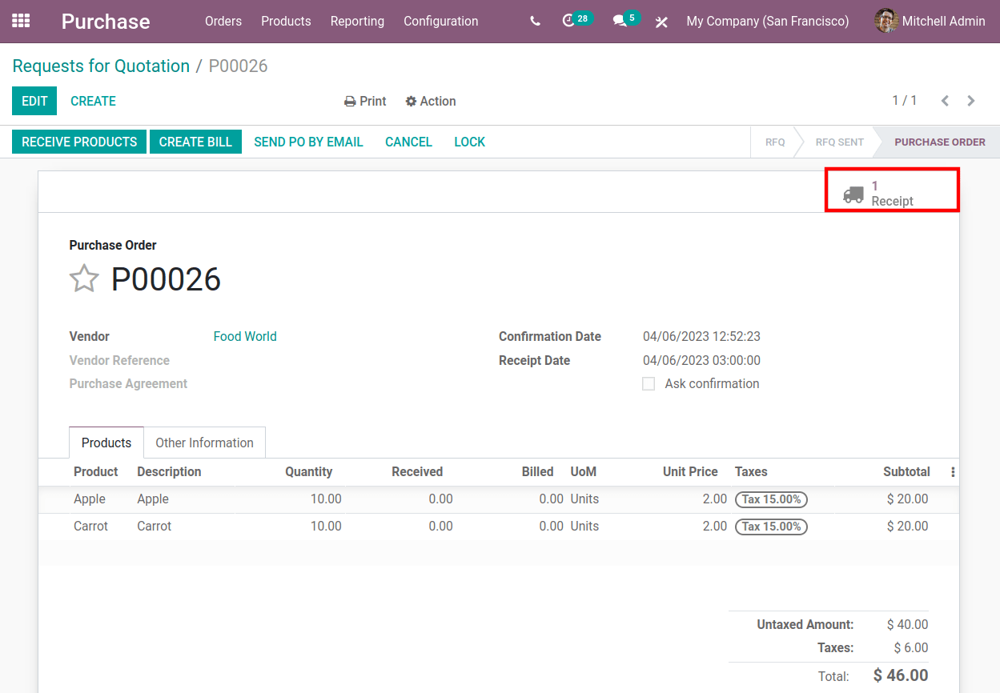
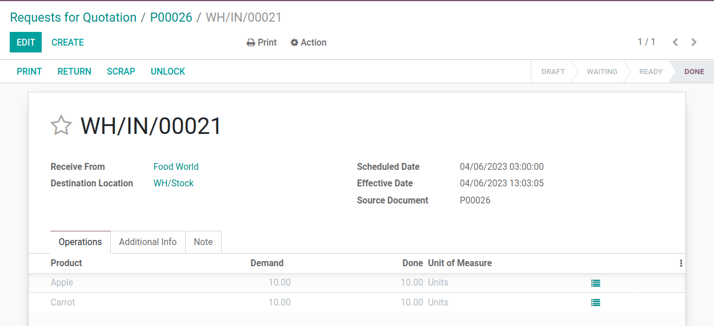
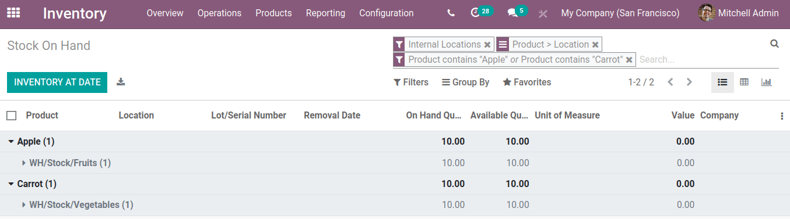
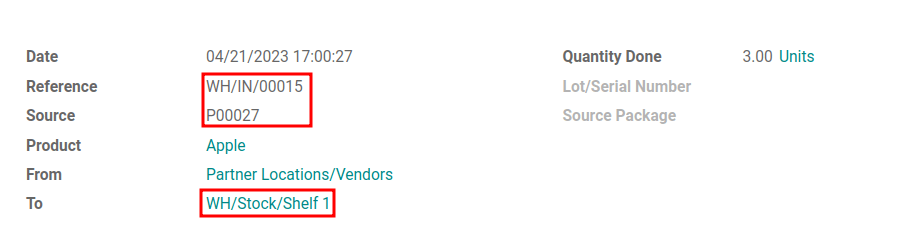
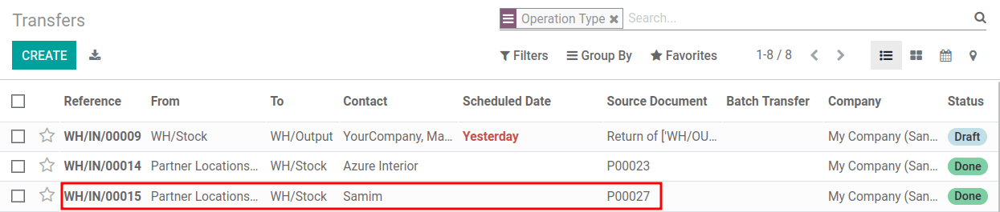
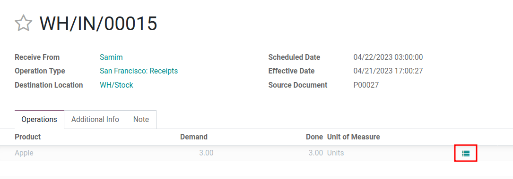

=============
Putaway Rules
=============

*Putaway* is the process of routing products to appropriate storage locations upon shipment arrival.
Odoo can accomplish this seamlessly using *putaway rules*, which dictate how products move through
specified warehouse locations.

Upon shipment arrival, operations are generated based on putaway rules to efficiently move products
to specified locations and ensure easy retrieval. Putaway rules can also prevent volatile substances
from being stored in close proximity by directing them to different locations determined by the
warehouse manager.

.. seealso::
   - :ref:`Routes -- how products move<inventory/routes/use_routes/push>`
   - :ref:`Warehouse locations<inventory/warehouse_location/definition>`

Enable putaway rules
====================

Begin by navigating to :menuselection:`Inventory --> Configuration --> Settings`, then activate the
:guilabel:`Multi-Step Routes` checkbox under the :guilabel:`Warehouse` heading. By doing so, the
:guilabel:`Storage Locations` setting is automatically enabled as well. Finally, click
:guilabel:`Save`.

.. image:: putaway/multi-step-routes.png
   :align: center
   :alt: Check multi-step routes box

Put away products
=================

Putaway rules are commonly used to move products to specific locations for easy retrieval. Thus,
products are grouped in the same :guilabel:`Product Category` when a single putaway rule captures
the group's storage needs.

To manage where specific products are routed for storage, navigate to :menuselection:`Inventory -->
Configuration --> Putaway Rules`. Use the :guilabel:`Create` button to configure a new putaway rule
on a :guilabel:`Product` and/or :guilabel:`Product Category` that the rule affects.

In the same line, the :guilabel:`When product arrives in` location is where the putaway rule is
triggered to create an operation to move the product to the :guilabel:`Store to` location. The
:guilabel:`Store to` location must be sublocation of the first (ie. `WH/Stock/Fruits` is a specific,
named location inside `WH/Stock` to make the products stored here easier to find).

.. example::
   Ensure all apples are stored in the fruits section by filling field :guilabel:`Store to` with the
   location `WH/Stock/Fruits` when the :guilabel:`Product`, `Apple` arrives in `WH/Stock`. Repeat
   this for all products and hit :guilabel:`Save`.

   .. image:: putaway/create-putaway-rules.png
      :align: center
      :alt: Create putaway rules for apples and carrots.

.. note::
  It is also possible to create and manage putaway rules for a single product by going to the
  product page and clicking the :guilabel:`Putaway Rules` smart button at the top of the page. If
  the button isn't there at first glance, select the :guilabel:`More` button at the top right to
  view additional configuration options.

.. _inventory/putaway/internal-stock-moves:

.. tip::
   Check whether putaway rules work as intended and using the summary of internal product movements.
   In the :guilabel:`Inventory` app, select :menuselection:`Reporting --> Product Moves` and enable
   the :guilabel:`Internal` search filter on the :guilabel:`Filters` dropdown under the search bar
   at the top of the page. In this view, confirm that products are moved to the :guilabel:`Store to`
   location detailed in the putaway rule. More details in :ref:`this section
   <inventory/putaway/wrong-location>`.

Use putaway rules
-----------------

Once a putaway rule has been configured, the product it specifies is automatically routed to the
:guilabel:`Store to` location upon arriving in the :guilabel:`When product arrives in` location.

After configuring the putaway rules for apples and carrots, see the internal stock moves by
first buying products from a vendor using a :ref:`purchase order<inventory/purchase/vendor bills>`
(PO).

To create a :guilabel:`Request for Quotation` (RFQ), go to the :guilabel:`Purchase` app, and click
:guilabel:`Create`. Then, add products to the :abbr:`RFQ (Request for Quotation)` by clicking
:guilabel:`Add a line`, and selecting the desired product(s) from the drop-down menu in the
:guilabel:`Product` column.

Once ready, click :guilabel:`Confirm`. Doing so turns the :abbr:`RFQ (Request for Quotation)` into a
:abbr:`PO (Purchase Order)`. Next, click :guilabel:`Send by Email` to send the :abbr:`PO (Purchase
Order)` to the vendor if needed.

Receive the incoming shipment by selecting :menuselection:`Receive products --> Validate`.

Verify stock moves
==================

Confirm whether the putaway rule worked as intended and that the products have been moved to the
correct location in the :guilabel:`Inventory Report`. View all products in stock in
:menuselection:`Inventory --> Reporting --> Inventory Report`. By default, the products are
grouped by location.

Select the product, and the drop-down displays the locations the products currently are. In the
image below, the locations shown are `WH/Stock/Fruits` and `WH/Stock/Vegetables`, which
confirms that the putaway rules successfully.

For a more detailed report, click on a stock move line. On the report, the :guilabel:`Reference`
displays the warehouse operation associated to the :guilabel:`Product`. These can be any operation
involving movement of stock, such as manufacturing orders, inventory adjustments, or internal
transfers. The :guilabel:`Source` links the document associated to the reference operation. Use the
:guilabel:`From` and :guilabel:`To` location and the associated documents to trace the path of the
product.

.. _inventory/putaway/wrong-location:

Trace products in wrong locations
---------------------------------

Pictured below is a detailed stock move of the :guilabel:`Product`, `Apple` that was put away in the
wrong location. This report is useful to trace the path the product moved and identify the cause of
the wrong stock move.

Start by selecting the stock move record for `Apple`. Here, a putaway rule was purposely set up
incorrectly, so the product was moved from `WH/Stock` to `WH/Stock/Shelf 1` instead of the expected
location, `WH/Stock/Fruits`.

The :guilabel:`To` field displays where the product currently is, `WH/Stock/Shelf 1`, which is the
wrong location. The :guilabel:`From` location is the vendor's location, which is expected since the
:guilabel:`Source` of the stock move is a :abbr:`PO (Purchase Order)`.

Diagnose why the apple ended up in the shelf by following the :guilabel:`Reference` warehouse
operation in :menuselection:`Inventory --> Operations --> Transfers`. This is the page that displays
all warehouse transfers-- internal or external. Click on the desired record.

.. tip::
   When there are too many records, use either the :guilabel:`Filters` or :guilabel:`Group by`
   features to sort and :ref:`find desired records<inventory/putaway/use-advanced-filters>`.

On the warehouse reception document, the field :guilabel:`Destination Location` shows where the
product is received upon entering the warehouse.

Clicking on the :guilabel:`Detailed Operations` icon (4 horizontal lines) to the right of the
product opens a window that shows the product was moved to the wrong location. Based on this
information it can be gathered that the putaway rule was triggered but the location was set
incorrectly. Rectify this in :menuselection:`Inventory --> Configuration --> Putaway Rules`.

.. image:: putaway/automated.png
   :align: center
   :alt: Show putaway rule in detailed operations popup

.. _inventory/putaway/use-advanced-filters:

Search for products using advanced filters
------------------------------------------

Keep track of and trace products on the :guilabel:`Product Moves` page. Navigate to the page from
:menuselection:`Inventory --> Reporting --> Product Moves` and use the :guilabel:`Filters` and
:guilabel:`Group by` features to stay updated on warehouse operations.

Transfers based on putaway rules can be found by toggling on the :guilabel:`Internal` filter as
mentioned in this :ref:`tip<inventory/putaway/internal-stock-moves>` previously. Other useful
filters and groupbys intended for reporting on the company's internal operations include:

#. Filter by :guilabel:`Incoming` and :guilabel:`To Do`: Display shipments from vendors yet to be
   processed.

   .. image:: putaway/product-moves-to-do.png
      :align: center
      :alt: Filter by incoming and todo

#. Use custom filters to search for a specific product by its name, :ref:`lot/serial number
   <inventory/management/lots-serial-numbers>` or barcode. Create a custom filter by mousing over
   :guilabel:`Filters`. Click :guilabel:`Add Custom Filter`, fill in the identifying information,
   and click :guilabel:`Apply`. Now that the custom filter is active, click on the
   :guilabel:`Filters` button again to create any additional filters.

#. Group by :guilabel:`Date`: View all product moves on a specific date

#. Group by :guilabel:`From`: Create a custom filter that displays all locations that currently
   stores at least 1 product. This is useful to view all the locations and sublocations and see
   whether they are used to their full capacity.

#. :guilabel:`Favorite` current search with filters applied. Useful to apply the filters promptly,
   especially if this search is often used.

   .. image:: putaway/save-favorites.png
      :align: center
      :alt: Save current search as favorite view
